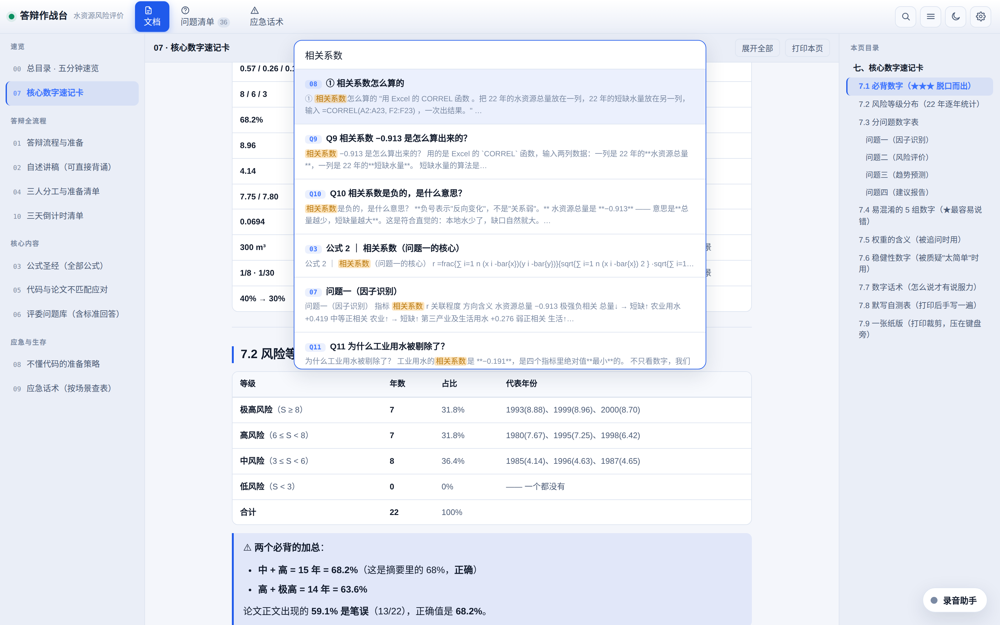
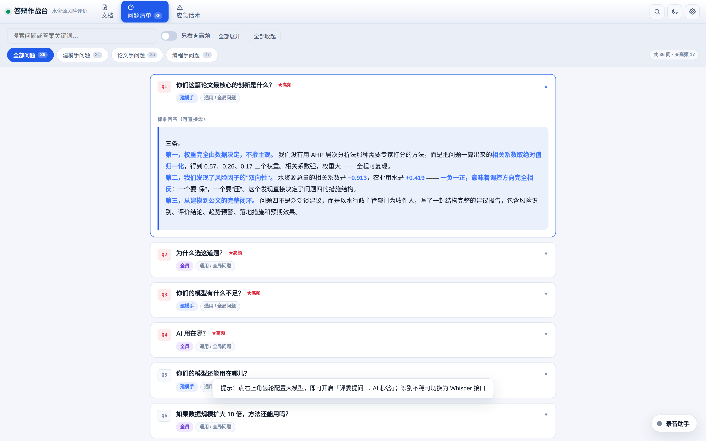
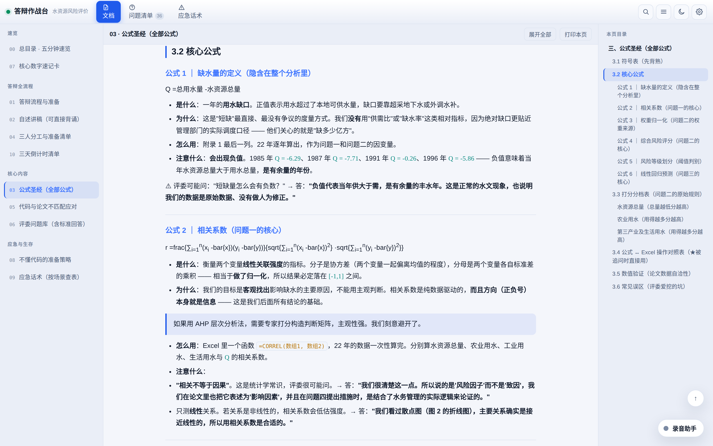
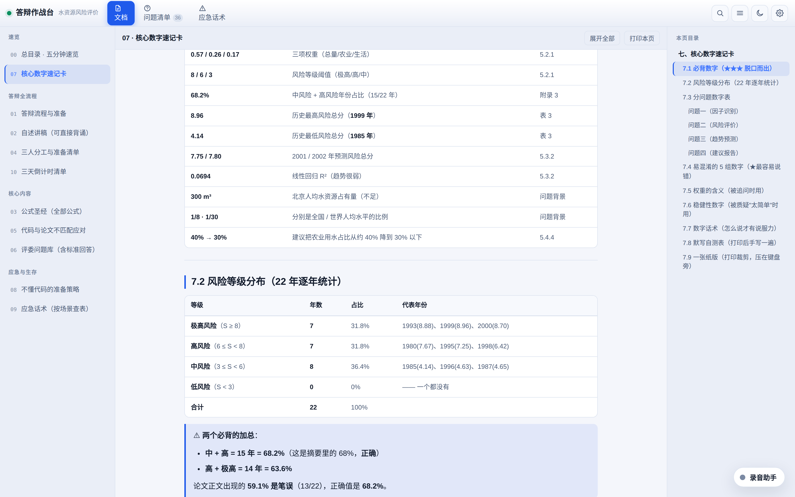
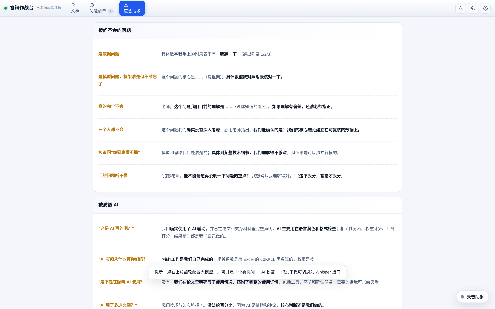
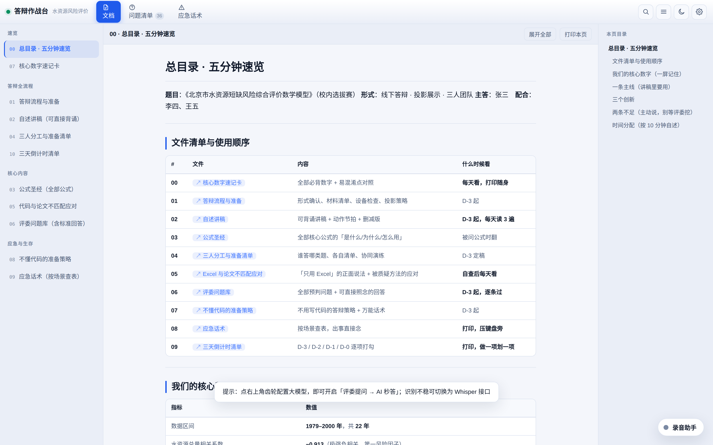
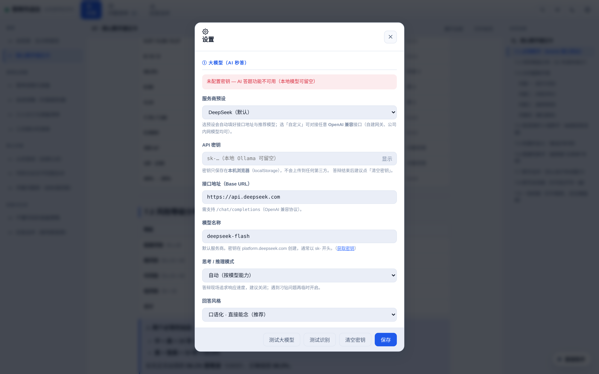
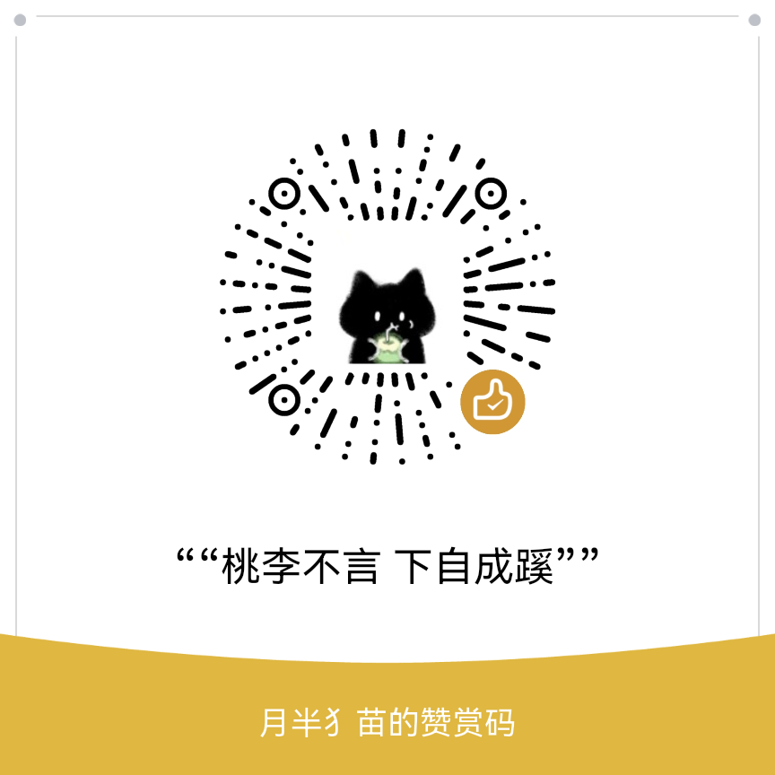

<div align="center">

# 🎓 数学建模答辩助手 · mcm-defense-kit

**把一份数学建模论文，变成一套答辩时能直接照着念、照着查的作战工具。**

[](https://yuguilai.github.io/mcm-defense-kit/)
[](./LICENSE)
[](#-产物长什么样)
[](#-作为-skill-使用)

**[在线体验 →](https://yuguilai.github.io/mcm-defense-kit/)** ｜ [看效果](#-产物长什么样) ｜ [快速开始](#-快速开始) ｜ [作为 Skill 使用](#-作为-skill-使用)

</div>

---

## 这是什么

一个面向**数学建模竞赛答辩**（国赛 CUMCM / 美赛 MCM-ICM / 研赛 / 电工杯等）的自动化工具包。

喂给它你的**赛题、论文、代码**，它会：

1. 通过**结构化访谈**问出那些"材料里读不到、但答辩一定会被问"的信息
2. 生成 **11 份 Markdown 答辩手册** —— 讲稿、公式圣经、评委问题库、应急话术、核心数字速记卡……
3. 打包成**一个单文件 HTML 应用** —— 双击即开，手机能用，自带搜索、AI 问答、语音提问检测

> 赛制不限。国赛线上、美赛 ZOOM、线下答辩，流程大同小异，都适用。

> 📌 **本页截图与在线演示，均由一道真实的竞赛题（水资源短缺风险综合评价）完整跑通 skill 生成**，未经后期修饰。示例中的人员姓名均为化名。

---

## ✨ 产物长什么样

### 全局搜索

跨文档 / 问题 / 话术全文模糊检索，`Ctrl/Cmd + K` 唤起，命中高亮 + 直接跳转。



### 评委问题库

按「建模手 / 编程手 / 论文手」筛选，卡片展开看标准回答。**回答是口语稿，可以直接念。**



### 公式圣经

每篇论文的公式逐个拆解：**是什么 / 为什么 / 怎么用 / 注意什么**，附「人话翻译」和「答辩口播」。上下标、块级公式正常渲染。



### 核心数字速记卡

上考场前最后翻的一页：必背数字、易混数字对照、自测默写表。



### 应急话术

现场被问懵了，翻到这一页照着念。



### 五分钟速览

评委和你自己最先看的一页：文件清单、核心数字、三条创新、两条不足。



### 设置面板（模型与语音全部可配）



---

## 🚀 快速开始

### 环境要求

只需要 **Node.js ≥ 18**。没有其他依赖，不需要 `npm install`。

### 三步跑通

```bash
# 1. 准备你的 11 份 Markdown（可以先用模板起步）
cp mcm-defense-kit/assets/templates/content/*.md ./handbook/

# 2. 一条命令构建（内部自动跑 make-meta → parse → bundle）
node mcm-defense-kit/scripts/build.js \
  --src ./handbook \
  --out ./dist \
  --title "我的答辩作战台"

# 3. 打开产物
open ./dist/index.html      # macOS
xdg-open ./dist/index.html  # Linux
```

产物 `dist/index.html` 是**单文件**，零外链资源。发微信、传网盘、拷 U 盘都能用。

### 命令行参数

| 参数 | 说明 |
|---|---|
| `--src <目录>` | 11 份 md 所在目录（必填） |
| `--out <目录>` | 输出目录（必填） |
| `--title "<标题>"` | 页面标题 / favicon 文案 |
| `--team "<队名>"` | 队名或学校 |
| `--slogan "<副标题>"` | 左上角 logo 下的小字，建议填本题关键词，如「水资源风险评价」 |
| `--template <文件>` | 自定义 HTML 模板（默认用 `assets/template.html`） |
| `--skip-meta` | 跳过 meta.json 生成（手改过 meta.json 时用） |

---

## 🤖 作为 Skill 使用

`mcm-defense-kit/` 子目录就是一个**完整的 Agent Skill**，可以直接安装到任意支持 skill 的 agent 工具里。

### 安装

```bash
# 复制到你的 agent skills 目录
cp -r mcm-defense-kit ~/.codebuddy/skills/
```

或者把 `mcm-defense-kit/` 整个目录的内容放进你的 skills 目录。

### 装好之后

Agent 会在你提到「数学建模答辩」「答辩手册」「评委提问」「答辩自述稿」等场景时自动加载它，然后：

1. **读**你的赛题 / 论文 / 代码
2. **问**你 4–8 个关键问题（答辩形式、时长、团队短板、最大风险点……）
3. **写** 11 份 Markdown
4. **构建**单文件 HTML
5. **验收**（零公式残留、零运行时错误、手机端不溢出）

### 目录结构

```
mcm-defense-kit/                     ← 仓库根
├── README.md                        你正在看的这份
├── LICENSE
├── docs/                            GitHub Pages 在线演示
│   ├── index.html
│   └── screenshot-*.png
├── examples/demo-water-resources/   示例：一道真实赛题生成的 11 份 md（人员为化名）
└── mcm-defense-kit/                 ← ★ Skill 本体
    ├── SKILL.md                     技能定义与 6 阶段工作流
    ├── scripts/
    │   ├── build.js                 一条命令跑完三步
    │   ├── make-meta.js             扫 md → meta.json
    │   ├── parse.js                 md → JSON（含公式与问题抽取）
    │   ├── bundle.js                JSON + 模板 → 单文件 HTML
    │   └── latex.js                 LaTeX → Unicode（130+ 符号 + 上下标）
    ├── assets/
    │   ├── template.html            网页模板（2500 行，自带全部 UI 与运行时）
    │   └── templates/content/       11 份 Markdown 内容模板
    └── references/
        ├── interview-guide.md       访谈提纲
        ├── writing-guide.md         11 份文档写作规范
        └── troubleshooting.md       排查手册
```

---

## 📦 生成的 11 份文档

| # | 文档 | 类型 | 说明 |
|---|---|---|---|
| 00 | 总目录 · 五分钟速览 | 变量 | 文件清单、核心数字、一条主线、三个创新、两条不足 |
| 01 | 答辩流程与准备 | **固定** | 形式确认、材料清单、设备检查、屏幕共享策略、扣分点 |
| 02 | 自述讲稿 | 变量 | 按时长切段的逐段讲稿 + 动作提示 + 删减版对照表 |
| 03 | 公式圣经 | 变量 | 每公式四问 + 公式↔代码对照表 + 敏感性分析 |
| 04 | 三人分工与准备清单 | **固定** | 角色定义、分工表、三份清单、协同演练、现场纪律 |
| 05 | 代码与论文不匹配应对 | 变量 | 四类不一致的话术 + 不懂代码的分层回应法 |
| 06 | 评委问题库 | **固定+变量** | 27 道通用题骨架 + 按本题扩充（示例生成 36 题），带追问链 |
| 07 | 核心数字速记卡 | 变量 | 必背数字、分问题数字表、易混数字组、默写自测 |
| 08 | 不懂代码的准备策略 | **固定** | L1–L5 分层表、三天速成法、万能回答模板 |
| 09 | 应急话术 | **固定+变量** | 40 行话术表，按 7 类场景查表，含本题专项 |
| 10 | 三天倒计时清单 | **固定** | D-3 / D-2 / D-1 / D-0 逐项 checkbox |

> **固定** = 结构与话术已写好，只需填少量本队信息；**变量** = 必须按你的赛题重写。
> 拿到 skill 的 agent 会自己判断该填还是该重写。

---

## 🎛 内置的模型与语音服务

### 大模型（8 个预设 + 完全自定义）

全部走 **OpenAI 兼容协议**，改 Base URL + 模型名即可接任意服务商。

| 预设 | Base URL | 典型模型 |
|---|---|---|
| DeepSeek | `https://api.deepseek.com` | `deepseek-chat` / `deepseek-reasoner` |
| OpenAI | `https://api.openai.com/v1` | `gpt-4o-mini` / `gpt-4o` / `gpt-4.1` |
| 通义千问 | `https://dashscope.aliyuncs.com/compatible-mode/v1` | `qwen-plus` / `qwen-max` |
| 智谱 GLM | `https://open.bigmodel.cn/api/paas/v4` | `glm-4-plus` / `glm-4-flash` |
| Kimi | `https://api.moonshot.cn/v1` | `moonshot-v1-8k` / `-32k` / `-128k` |
| 硅基流动 | `https://api.siliconflow.cn/v1` | `Qwen/Qwen2.5-72B-Instruct` 等 |
| Ollama 本地 | `http://localhost:11434/v1` | `qwen2.5:7b` / `deepseek-r1:7b` |
| 自定义 | 你填 | 你填 |

> Ollama 本地模型**无需密钥**，离线也能用。

### 语音识别（浏览器原生 + Whisper 兼容，5 个预设）

| 预设 | 说明 |
|---|---|
| 浏览器内置 | 零配置，用 `SpeechRecognition`，Chrome / Edge 可用 |
| OpenAI Whisper | `whisper-1` / `gpt-4o-mini-transcribe` |
| Groq | `whisper-large-v3-turbo` —— **快且便宜，推荐** |
| 硅基流动 | `FunAudioLLM/SenseVoiceSmall` |
| 本地 faster-whisper | `http://localhost:8000/v1` |
| 自定义 | 任意 OpenAI 兼容 `/audio/transcriptions` 端点 |

**工作方式**：浏览器录音 → 按「切片时长」分段（默认 6 秒）→ 串行上传转写 → 文本回流，自动检测问句并提示「要不要让 AI 答」。

---

## ❓ 常见问题

**Q：一定要联网吗？**
产物本身**不需要**。双击 `index.html` 就能看全部 11 份文档。只有「AI 秒答」和「Whisper 语音识别」需要联网（或用本地 Ollama / faster-whisper）。

**Q：密钥安全吗？**
密钥只存在**你自己的浏览器 localStorage** 里，不上传任何第三方。页面里还提供「清空密钥」按钮。

**Q：为什么浏览器内置语音识别用不了？**
它只在 Chrome / Edge 有效，且**必须 HTTPS 或 localhost**。`file://` 直接打开会静默失败。建议改用 Whisper 接口。

**Q：支持美赛吗？**
支持。赛事范围是通用的，美赛只需在访谈时说明，讲稿和话术会自动调整为英文答辩场景。

**Q：一定要用 AI 写吗？**
不一定。你也可以手写 11 份 md，然后用 `build.js` 打包成网页 —— 构建管线跟 AI 无关。

**Q：我的公式渲染不出来？**
检查三点：① 用 `$...$` 而不是 `\(...\)`；② 块级公式 `$$...$$` 独占一行；③ 表格里含绝对值号 `|` 的公式，写成 `$\gamma\sum(|\Delta f_i|)$`（紧贴 `$`）。详见 [`references/troubleshooting.md`](mcm-defense-kit/references/troubleshooting.md)。

---

## 🛠 技术实现

| 环节 | 做法 |
|---|---|
| **标记语言** | 自研轻量 Markdown → HTML（`parse.js`，629 行），无需构建依赖 |
| **公式渲染** | 自研 LaTeX → Unicode 转换器（`latex.js`，246 行，130+ 符号 + 上下标表），**不依赖 MathJax / KaTeX**，所以离线可用 |
| **块级公式** | 在 `mdToHtml` 层**预抽取**跨行 `$$...$$` 为占位符，避免按行切分时被拆散 |
| **表格保护** | 切分表格行前先对 `$...$` 内的 `|`（绝对值符）占位，防止被当成分列符 |
| **打包** | 数据与模板内联成单文件（`bundle.js`），用**函数形式 replace** 避免 `$&` 特殊模式污染 |
| **自检** | `bundle.js` 用 `vm.Script` 预检内联脚本语法 + 扫描未替换占位符 + 统计外链资源 |

**零运行时依赖**：产物是一个 HTML，没有 CDN、没有 web font、没有外部图片。

---

## 🤝 贡献

欢迎提 Issue 和 PR。特别欢迎：

- 新增文档模板（比如「英文答辩专项」「线下答辩礼仪」）
- 新的模型 / 语音服务商预设
- 公式渲染器的符号补全

## 📄 License

[MIT](./LICENSE) —— 随便用，答辩顺利。

---

## ☕ 赞赏

这套工具从头到尾**免费、开源、无广告**，产物里的 AI 和语音功能也是直连你自己的密钥，我这边没有任何收费环节。

如果它帮你省下了几个熬夜的晚上，或者让你在答辩场上多接住了两个问题，可以请我喝杯咖啡 —— 完全随意，不赞赏也照常能用、照常更新。

<div align="center">



**「桃李不言，下自成蹊」**

<sub>月半⺌苗 的赞赏码</sub>

</div>

> 感谢每一位愿意把它转发给学弟学妹的人 —— 那比赞赏更让我高兴。

---

<div align="center">

**祝答辩顺利，评委满意。** 🎯

</div>
